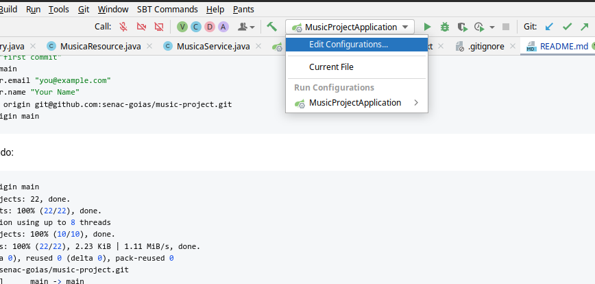
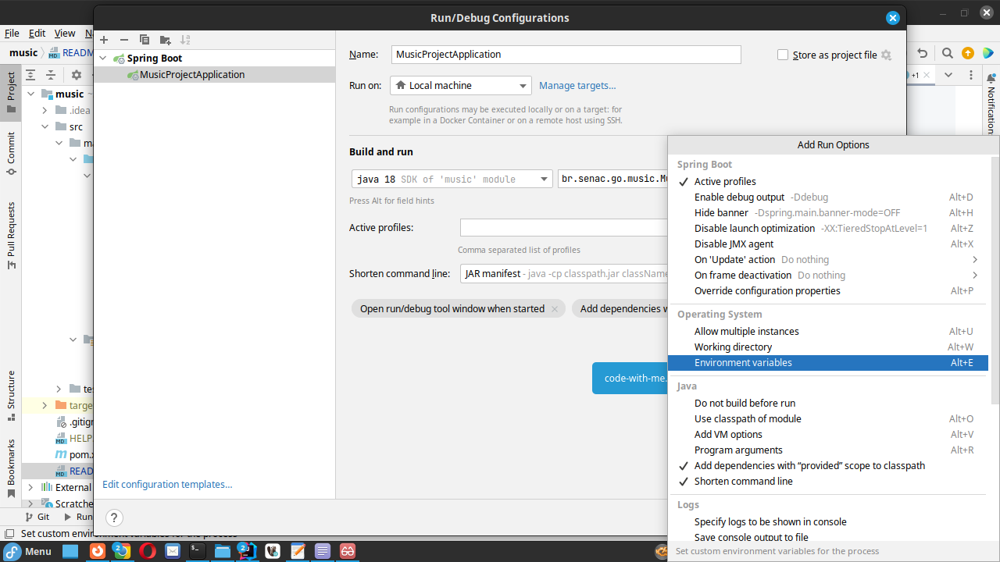
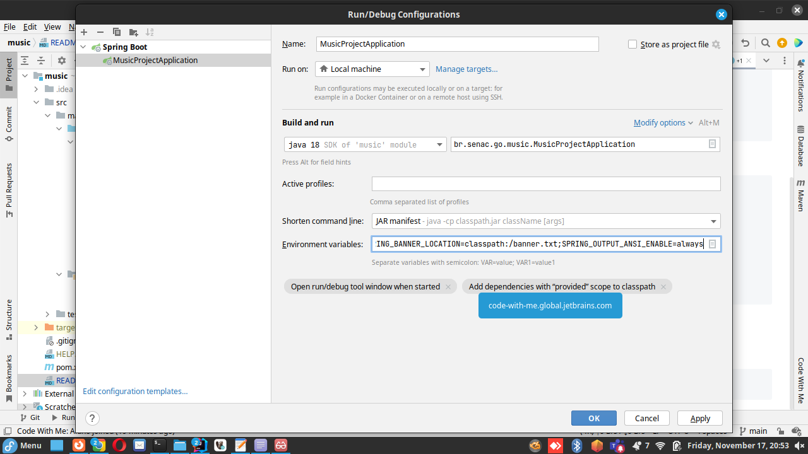

# Projeto Music
Escopo deste projeto é praticar o aprendizado relacionado ao uso de JPA em projetos java usando springboot.

### Configuração do git
```shell
git init
git add .
git commit -m "first commit"
git branch -M main
git config user.email "you@example.com"
git config user.name "Your Name"
git remote add origin git@github.com:senac-goias/music-project.git
git push -u origin main
```
Resultado esperado:

```shell
git push -u origin main
Enumerating objects: 22, done.
Counting objects: 100% (22/22), done.
Delta compression using up to 8 threads
Compressing objects: 100% (10/10), done.
Writing objects: 100% (22/22), 2.23 KiB | 1.11 MiB/s, done.
Total 22 (delta 0), reused 0 (delta 0), pack-reused 0
To github.com:senac-goias/music-project.git
 * [new branch]      main -> main
branch 'main' set up to track 'origin/main'
```

### Configuração das variáveis de ambiente
Estas variáveis de ambiente devem ser informadas na configuração do seu projeto.
Seja no build ou seja na configuração do maven

```
SPRING_BANNER_CHARSET=UTF-8;SPRING_BANNER_LOCATION=classpath:/banner.txt;SPRING_OUTPUT_ANSI_ENABLE=always
```

### Configuração das variáveis de ambiente no IntelliJ Community
#### Configuração inicial

#### Opção de configuração das variáveis de sistema

#### Inserindo as variáveis de sistema
